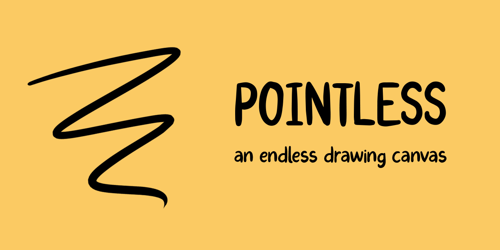
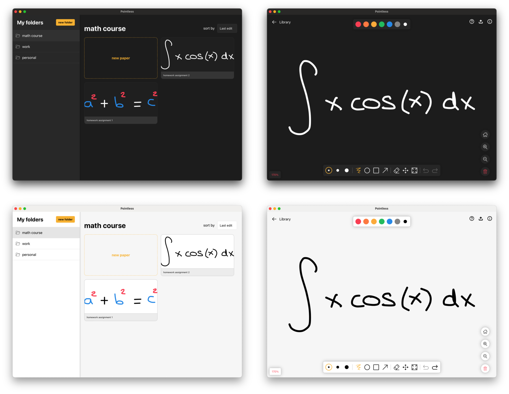

<p align="center">
  
  
  <a href="https://github.com/kkoomen/pointless/blob/master/LICENSE">
    
  </a>
</p>

# Table of Contents

- [Table of Contents](#table-of-contents)
- [Introduction](#introduction)
- [Features](#features)
- [Prerequisites](#prerequisites)
- [Installation](#installation)
- [Development](#development)
- [Creating a build](#creating-a-build)
- [FAQ](#faq)
- [License](#license)

# Introduction

Pointless is an endless drawing canvas that provides useful features when you're
in need for a simple whiteboard/note app.

It is build using Tauri (Rust) and React with a pure SVG canvas and local files
are saved with brotli-unicode compression to ensure small file sizes.

:package: If you want to use the app, grab yourself a prebuild binary
[here](https://github.com/kkoomen/pointless/releases/latest) and enjoy!

Arch linux users can use the [pointless AUR package](https://aur.archlinux.org/packages/pointless).

:handshake: Feel like contributing? Submit an issue with your ideas (or bugs) and
we'll discuss it.

# Features

- [x] Export as PNG
  - [x] PNG
  - [x] JPEG
  - [x] SVG
- [ ] Toolbar
  - [x] Undo
  - [x] Redo
  - [x] Pan
  - [x] Clear
  - [x] Zoom in
  - [x] Zoom out
  - [x] Scale to fit
  - [x] Create arrow shapes
  - [x] Create rectangle shapes
  - [x] Create ellipse shapes
  - [ ] Text
- [x] Create folders
- [x] Local file state persistence
- [x] Light/dark theme
- [x] Basic touch support
- [x] Select shapes
  - [x] Change color of selected shapes
  - [x] Copy/paste selected shapes

# Prerequisites

- [NodeJS](https://nodejs.org)
- [Yarn](https://classic.yarnpkg.com/lang/en/docs/install)
- [Cargo](https://doc.rust-lang.org/cargo/getting-started/installation.html)

# Installation

```
$ git clone https://github.com/kkoomen/pointless.git && cd pointless
$ yarn install
```

# Development

Starting the development server can be done with `yarn run tauri dev`

# Creating a build

Creating a build can simply be done with `yarn run tauri build`

# FAQ

- **Pointless.app is damaged and can't be opened:** This mac issue occurs
  because non-signed apps are blocked. You can fix this by running
  `xattr -cr /Applications/Pointless.app` and then open the app again.

# License

Pointless is licensed under the GPL-3.0 license.
